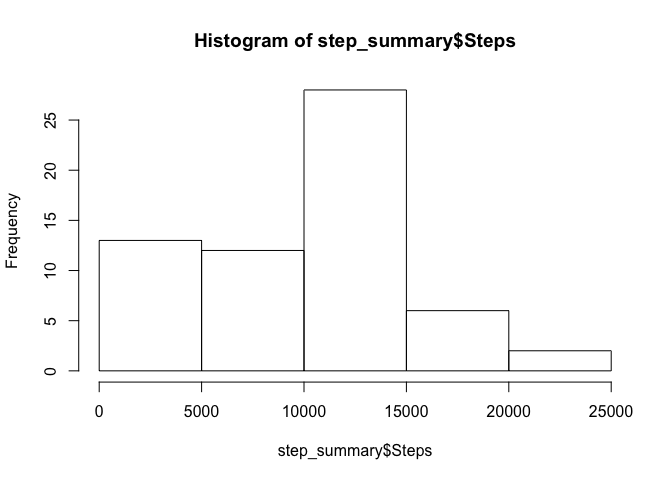
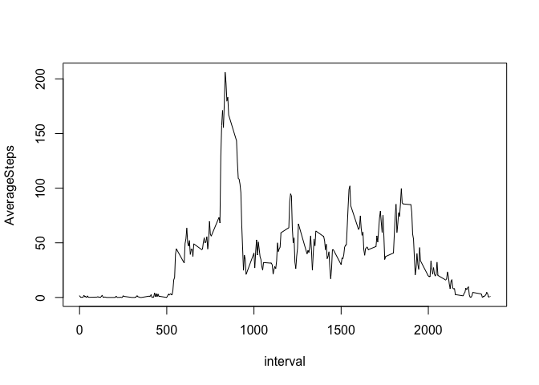
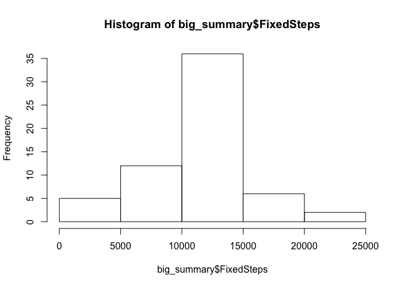
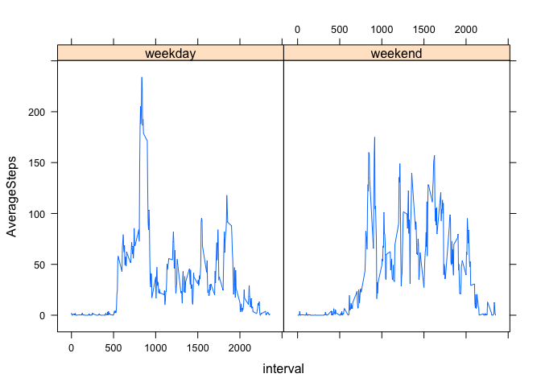

# Reproducible Research: Peer Assessment 1


## Loading and preprocessing the data
This assumes that the zip file is in a subdirectory called "RepData_PeerAssessment1"  
I created "DateTime" column, but it turned out that I didn't need it.  


```r
library(plyr)
library(dplyr)
```

```
## 
## Attaching package: 'dplyr'
## 
## The following objects are masked from 'package:plyr':
## 
##     arrange, count, desc, failwith, id, mutate, rename, summarise,
##     summarize
## 
## The following objects are masked from 'package:stats':
## 
##     filter, lag
## 
## The following objects are masked from 'package:base':
## 
##     intersect, setdiff, setequal, union
```

```r
library(lubridate)
```

```
## 
## Attaching package: 'lubridate'
## 
## The following object is masked from 'package:plyr':
## 
##     here
```

```r
file_name <- "activity.zip"
zip_list <- unzip(file_name)
all_steps <- read.csv(zip_list, stringsAsFactors = FALSE)
all_steps$date <- ymd(all_steps$date)
all_steps <- mutate(all_steps, 
                  DateTime = ymd_hm(paste(date,
                              sprintf("%02d:%02d", interval%/%100, interval%%100), 
                              sep = " ")))
```


## What is mean total number of steps taken per day?


```r
step_summary <- summarise(group_by(all_steps, date), sum(steps, na.rm = TRUE))
names(step_summary)[2] <- "Steps"
hist(step_summary$Steps)
```

 

```r
step_mean <- mean(step_summary$Steps, na.rm = TRUE)
step_median <- median(step_summary$Steps, na.rm = TRUE)
```

The mean is 9354.2295082  
The median is 10395  


## What is the average daily activity pattern?


```r
interval_summary <- summarise(group_by(all_steps, interval), mean(steps, na.rm = TRUE))
names(interval_summary)[2] <- "AverageSteps"
with(interval_summary, {
      plot(interval, AverageSteps, type = 'l')
})
```

 

```r
which.max(interval_summary$AverageSteps)
```

```
## [1] 104
```

```r
maxinterval <- interval_summary$interval[104]
```

The interval 835 has the most steps.  


## Imputing missing values

My approach was to take the average for the interval to fill in for missing values.  


```r
big_table <- join(all_steps, interval_summary)
```

```
## Joining by: interval
```

```r
big_table <- mutate(big_table, fixedsteps = ifelse(is.na(steps) == TRUE, AverageSteps, steps))
big_summary <- summarise(group_by(big_table, date), sum(fixedsteps, na.rm = TRUE))
names(big_summary)[2] <- "FixedSteps"
hist(big_summary$FixedSteps)
```

 

```r
big_mean <- mean(big_summary$FixedSteps, na.rm = FALSE)
big_median <- median(big_summary$FixedSteps, na.rm = FALSE)
```

The mean was 1.0766189\times 10^{4}  
The median was 1.0766189\times 10^{4}  

## Are there differences in activity patterns between weekdays and weekends?

I noticed that there are different patterns on the weekend  


```r
big_table <- mutate(big_table, 
                   DayType = ifelse(weekdays(date) %in% c("Saturday", "Sunday"), "weekend", "weekday"))
big_table$DayType <- as.factor(big_table$DayType)

big_interval_summary <- summarise(group_by(big_table,DayType, interval), mean(steps, na.rm = TRUE))
names(big_interval_summary)[3] <- "AverageSteps"


library(lattice)
with(big_interval_summary, {
      xyplot(AverageSteps ~ interval | DayType, type = "l")
})
```

 


Thanks for reading my findings!

Daniel Frett  


